
| Icon | Name | Icon | Name | Icon | Name | Icon | Name | Icon | Name | Icon | Name | Icon | Name |
| --- | --- | --- | --- | --- | --- | --- | --- | --- | --- | --- | --- | --- | --- |
| | file |  | ada |  | adobe-aftereffects |  | adobe-audition |  | adobe-illustrator |  | adobe-indesign |  | adobe-photoshop |
| | adobe-premierepro |  | adobe-xd |  | agda |  | apache |  | apk | 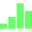 | apple-numbers |  | apple-pages |
| | aspnet |  | astro |  | audio |  | autohotkey |  | autoit |  | batch |  | bazel |
| | blender |  | browserslist |  | bun |  | c |  | carbon |  | ceylon |  | changelog |
| | clean |  | clojure |  | codeofconduct |  | coffeescript |  | config |  | cpp |  | crystal |
|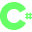 | csharp |  | css |  | css-map |  | css-rtl | 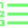 | csv |  | cursor |  | cypress |
| | d |  | dart |  | dll |  | docker |  | drawio | 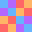 | dylan |  | editorconfig |
| | eiffel |  | elixir |  | elm |  | email |  | epub |  | erlang |  | eslint |
| | exe |  | favicon |  | firebase |  | flstudio |  | font |  | forth |  | fortran |
| | fsharp |  | gatsby |  | gemfile |  | git |  | gitpod |  | gnu |  | go |
| | gradle |  | groovy |  | gulp |  | hack |  | harbour |  | haskell |  | haxe |
| | html |  | husky |  | hy |  | icalendar |  | image |  | iso |  | java |
| | javascript |  | javascript-map |  | jquery |  | json |  | julia |  | jupyter |  | key |
| | kotlin |  | less |  | license |  | livescript |  | lock |  | log |  | lua |
| | markdown |  | matlab |  | microsoft-access | 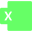 | microsoft-excel |  | microsoft-onenote | 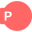 | microsoft-powerpoint |  | microsoft-visio |
| | microsoft-word |  | mizu |  | ml |  | music | 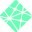 | netlify |  | nim |  | node |
| | npm |  | nvm |  | package |  | partytown |  | pdf |  | perl |  | php |
| | plantuml | 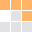 | pnpm |  | powershell | 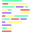 | prettier |  | processing |  | purescript |  | python |
| | r |  | racket |  | rails | 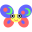 | raku | 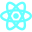 | react-js |  | react-ts |  | readme |
| | reason |  | rebol |  | red |  | rexx |  | robots |  | rspec |  | rubocop |
| | ruby |  | rust |  | sass |  | scala |  | scratch |  | shell |  | smallbasic |
| | sql |  | sqlite |  | stylelint |  | svg |  | swift |  | tcl |  | text |
| | toml |  | torrent |  | travis |  | typescript |  | typescript-def |  | typescript-map |  | typescript-spec |
| | url |  | vala |  | video |  | visualbasic |  | visualstudio |  | vmware |  | vscode |
| | vue |  | watchman |  | webmanifest |  | wolfram |  | xml |  | yaml |  | yarn |
| | zenodo |  | zig |  | zip |  | folder-white |  | folder-gray |  | folder-red |  | folder-orange |
| | folder-yellow |  | folder-chartreuse |  | folder-green |  | folder-spring |  | folder-cyan |  | folder-azure |  | folder-blue |
| | folder-purple |  | folder-rose |
